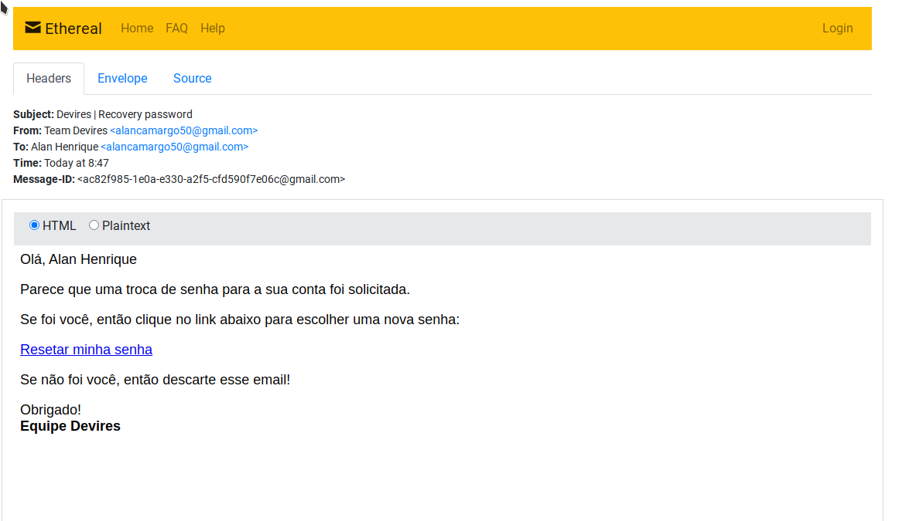

# Technologies Used

- Nodejs
- Typescript
- Jest / TDD
- MVC / DDD
- AWS S3 - SES
- CI / CD
- Postgres
- Eslint

```json
  Open the project and write

  yarn

  Clone file .env.example to .env and fill it

  yarn typeorm migration:run

  yarn dev
```

<br />

## Under Development

## Session
- Forgot password email send - POST api/password/forgot
```json
{
	"email": "alancamargo50@gmail.com"
}
```


- Reset password email user - POST api/password/reset
```json
{
	"password": "123456",
	"password_confirmation": "123456",
	"token": "731b14b9-005c-48e8-9ab1-9545a4451c6b"
}
```

## Admin
- Create User - POST api/users/
```json
{
	"name": "Alan Henrique",
	"email": "alancamargo50@gmail.com",
	"password": "123456",
	"type": "global",
	"status": "active"
}
```
- Delete User - DELETE api/users/:id

- Create Type - POST api/types/
```json
{
	"type": "root",
	"description": "Admin master"
}
```

<br />

## General
- List Profile Info - GET api/profile
```json
{
	"id": "5796e009-e0d4-46bb-9593-f621c87034bd",
  "name": "Alan Henrique",
  "email": "alancamargo50@gmail.com",
  "type": "global",
  "status": "active",
  "created_at": "2021-05-09T08:09:10.614Z",
  "updated_at": "2021-05-09T08:09:10.614Z",
  "avatar_url": null
}
```

- Upload User Avatar - PATCH api/profile/avatar
```json
{
  // Multipart data
	"avatar": "avatar.png",
}
```
<br />
<br />

### Desafio

Para este teste, você vai criar uma API REST que possibilite um cadastro de usuários e login, com as seguintes funcões:


**Usuários**
- [X] Cadastrar um novo usuário
- [X] Listar informações de um usuário
- Alterar o nome e tipo de um usuário
- [X] Excluir um usuário
- Alterar o status de um usuário(ativo e inativo)

**Tipos**
- Listar todos os tipos cadastrados


### Regras de negócio
- [X] A tabela de usuários deve conter os campos nome, senha, tipo, email e status.
- [X] A tabela de tipos deve a descrição do tipo.
- [X] Um usuário tem apenas um único tipo
- [X] Apenas usuários do tipo root e admin podem cadastrar novos usuários.
- Apenas usuários do tipo root admin podem alterar qualquer informação do usuário(inclusive status);
- [X] Apenas usuários root podem excluir usuários
- [X] Usuários do tipo geral só tem acesso a listar informações de seu próprio usuário, bem como alterar suas próprias informações.
- [X] O login deve ser feito com email e senha.


## Requisitos
- O projeto deve ser documentado, principalmente a arquitetura utilizada e as rotas para cada tarefa.
- [X] O projeto deve ser construído com Typescript
- O projeto deve ter uma cobertura considerável de testes unitários

### 🚫 O que não pode? (por favor 🙏😂)

- [X] usar eslint-disable em qualquer lugar
- [X] usar tipagem any (sem preguiça!)
- deixar qualquer warning ou erros no console do servidor
- [X] deixar erros do eslint
- códigos comentados
- console logs
- fazer apenas 1 commit com todo código
